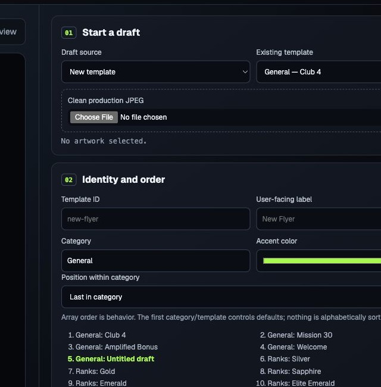
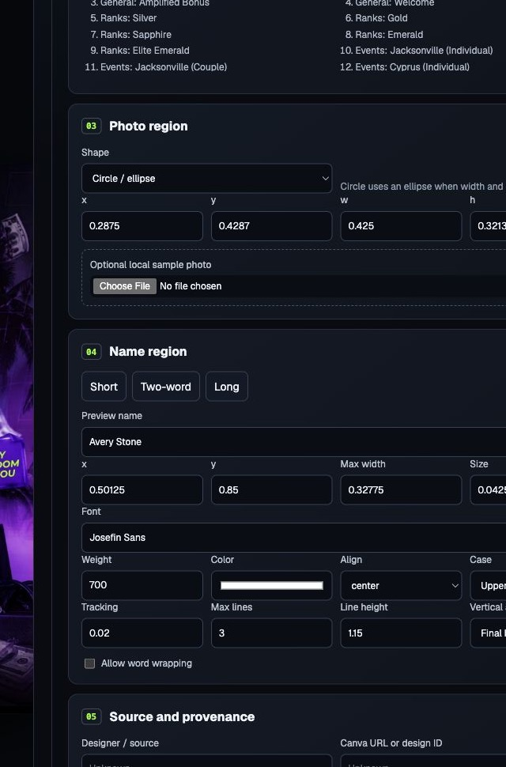
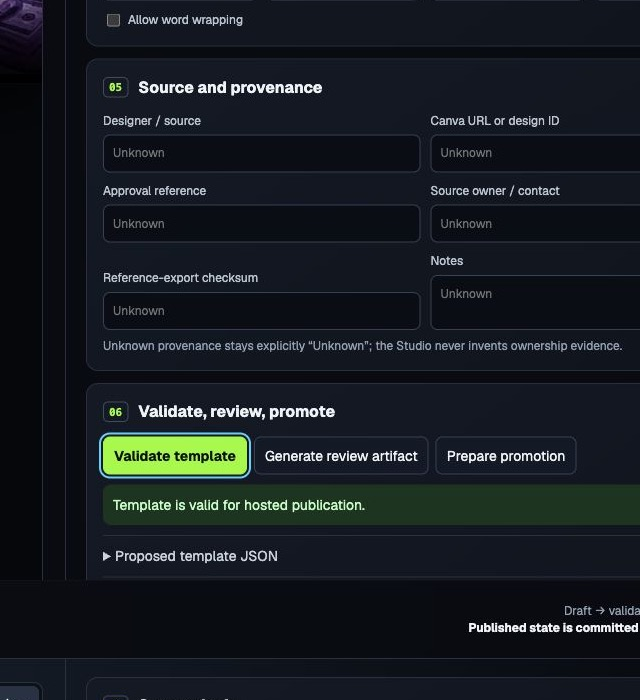
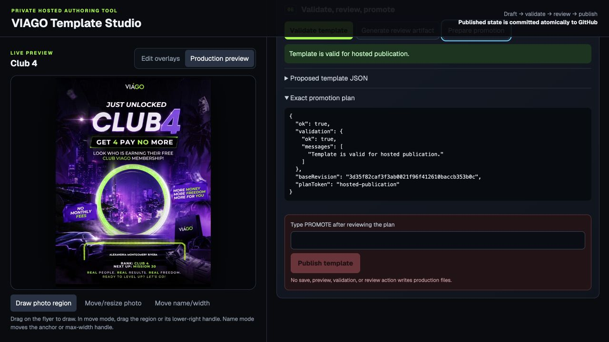
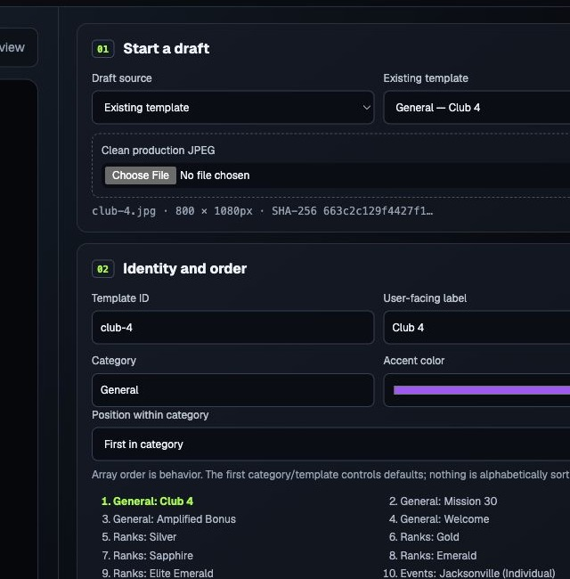

# VIAGO Template Studio

## Admin Instructions

For occasional template administrators. This guide covers the private Template Studio only.

> **Private Studio:** https://viago-template-studio-worker.noisy-bread-8a99.workers.dev/
>
> Sign in with your `@goodlifetrainings.com` Google account. Other domains cannot enter.

## 1. Open the Template Studio

1. Open the private Studio link above.
2. Choose the Good Life Trainings Google sign-in.
3. Select your `@goodlifetrainings.com` account.

**Screenshot needed before final visual approval:** Google account chooser followed by the first Studio screen. Capturing it requires signing out of the current protected session.

## 2. Create a new template

1. Under **Start a draft**, set **Draft source** to **New template**.
2. Under **Clean production JPEG**, choose the approved clean JPEG.
3. Enter the **Template ID**. Use lowercase letters, numbers, and hyphens.
   - Good: `welcome-new-member`, `cancun-2027`, `jacksonville-couple`
   - Avoid spaces, capitals, underscores, and punctuation.
4. Enter the **User-facing label**. This is the name staff see in the generator.
5. Choose the **Category**.
6. Choose the **Position within category**.
7. Keep or adjust the **Accent color** shown for the template.

## 3. Prepare the Canva file

Upload the **clean JPEG** exported from Canva.

Remove only:

- the sample/person photo;
- the dynamic placeholder name.

Keep:

- logos;
- event text and permanent wording;
- borders and backgrounds;
- decorative elements.

**Screenshot needed before final visual approval:** approved Canva example shown before cleanup and after clean JPEG export. No suitable paired source was available in the repository, so no mock artwork was invented.

## 4. Set the photo area

The photo area tells the generator where the uploaded person's picture appears.

1. Select **Edit overlays**.
2. Select **Draw photo region**, then drag over the flyer to draw the area.
3. Select **Move/resize photo** to move the area or drag its lower-right handle.
4. Set **Shape** to **Rectangle** or **Circle / ellipse**.
5. Use the `x`, `y`, `w`, and `h` boxes only for advanced fine-tuning.
6. Optionally upload a local sample photo for testing. It is preview-only.

## 5. Set the name

This controls where the person's name appears on the finished flyer.

1. Select **Move name/width**.
2. Drag the name anchor to position it.
3. Drag the width handle to set the available name width.
4. Use the visible **Name region** controls for:
   - preview name;
   - position and max width;
   - font, weight, size, and color;
   - alignment;
   - uppercase or preserve case;
   - tracking;
   - max lines and line height;
   - vertical alignment;
   - **Allow word wrapping**.

The numeric boxes are available for fine-tuning, but visual placement comes first.

## 6. Test the template

1. Select **Short** and check the name.
2. Select **Two-word** and check a normal name.
3. Select **Long** and check the longest preset.
4. Test a sample photo when one is available.
5. Switch between:
   - **Edit overlays** — position the photo area and name;
   - **Production preview** — see the finished flyer without overlay markers.

## 7. Validate

1. Select **Validate template**.
2. Wait for the result.
3. A successful result says: **Template is valid for hosted publication.**
4. Validation does **not** make anything live.
5. If validation fails, correct the reported issue and validate again.

## 8. Publish

Publish is the action that changes the live flyer generator.

1. Validate successfully.
2. Select **Generate review artifact** if a review copy is needed.
3. Select **Prepare promotion**.
4. Review the template, category, order, artwork, preview, and exact promotion plan.
5. Type `PROMOTE` in **Type PROMOTE after reviewing the plan**.
6. Select **Publish template**.
7. Wait for the success message and record the commit identifier shown by the Studio.

The current hosted Studio still requires the typed `PROMOTE` confirmation. Previewing, editing, validating, and preparing the plan do not change the live generator.

Cloudflare may need a short period before the public generator reflects the change.

## 9. Verify the live template

Open https://viago-flyer-generator.pages.dev/ and check only the new or updated template:

- correct category and position;
- correct thumbnail/artwork;
- photo area works;
- normal and long names look acceptable;
- downloaded PNG looks correct.

## 10. Edit an existing template

1. Set **Draft source** to **Existing template**.
2. Choose the exact template from **Existing template**.
3. Make the approved changes.
4. Preview and test short, two-word, and long names.
5. Validate.
6. Prepare and review the promotion plan.
7. Type `PROMOTE` and select **Publish template**.

Editing and previewing do not affect the public generator until Publish is confirmed.

## 11. Retire an old template

> **Template retirement is not yet available from the Studio interface.**

Do not invent a replacement workflow and do not overwrite an old template to hide it. Contact the platform owner to retire an obsolete template safely.

## 12. If something looks wrong

- Do not repeatedly publish trying to fix it.
- Stop and reopen the current template.
- Confirm the artwork and Production Preview.
- Validate again.
- If unsure, contact the platform owner.

## 13. Quick checklist

### Before Publish

- [ ] Clean JPEG uploaded
- [ ] Correct template name
- [ ] Correct category and order
- [ ] Photo area checked
- [ ] Short name checked
- [ ] Long name checked
- [ ] Production Preview checked
- [ ] Validation passed

### After Publish

- [ ] Appears in the public generator
- [ ] Photo works
- [ ] Name works
- [ ] Download checked

